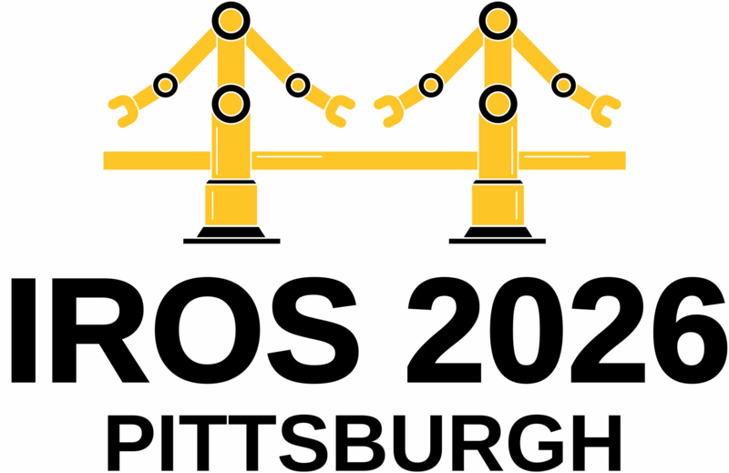
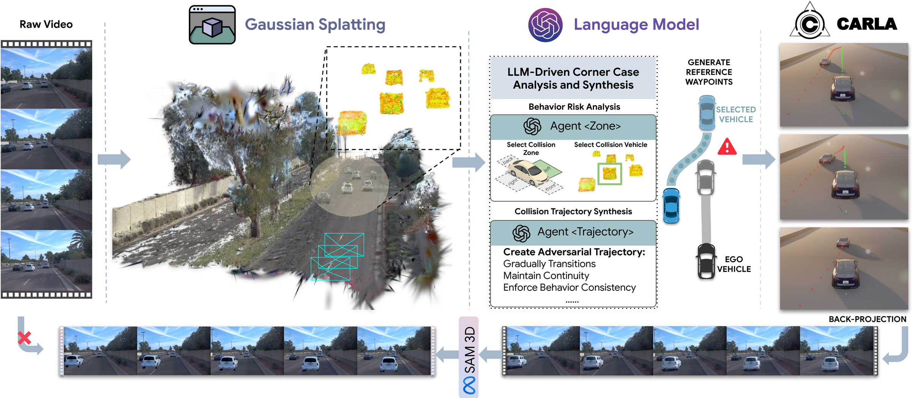

<div align="center">



# CARLA-GS

### Decoupling Representation, Reasoning, and Physics Simulation for Autonomous Driving Corner-Case Synthesis

[Kaicong Huang](#)<sup>1</sup> · [Meng Ma](#)<sup>1</sup> · [Ruimin Ke](#)<sup>1,✉</sup>

<sup>1</sup>Rensselaer Polytechnic Institute

**IROS 2026**

[](https://ccoopq.github.io/CARLA-GS/)
[](https://arxiv.org/html/2607.07601v1)
[](https://ccoopq.github.io/CARLA-GS/static/pdf/CARLA-GS_poster.pdf)
[](LICENSE)

</div>

---

## Overview

CARLA-GS turns real driving logs into **photorealistic, physically feasible corner cases**.
Each module does one job:

| Module | Role |
| --- | --- |
| **3D Gaussian Splatting** | Editable scene with separate vehicle actors. Geometry-consistent losses (flattening, normal, geometry). |
| **Multi-agent LLM** | `Agent<Zone>` picks the adversarial vehicle, collision zone, TTC and risk level. `Agent<Trajectory>` writes time-stamped waypoints. |
| **CARLA** | PID controller tracks the waypoints under vehicle dynamics. |
| **Back-projection** | Simulated poses go back into the Gaussian scene for ego-camera rendering. Optional SAM 3D asset replacement. |

<p align="center"></p>

## News

- **2026** — CARLA-GS accepted to IROS 2026 (Pittsburgh).
- Code released.

## Installation

Tested on Ubuntu 22.04, CUDA 11.8, one RTX 4090.

```bash
git clone https://github.com/ccoopq/CARLA-GS.git
cd CARLA-GS

conda create -n carla-gs python=3.8 -y
conda activate carla-gs
pip install torch==1.13.1+cu116 torchvision==0.14.1+cu116 --extra-index-url https://download.pytorch.org/whl/cu116
pip install -r requirements.txt

pip install ./submodules/diff-gaussian-rasterization   # adds normal / depth rendering
pip install ./submodules/simple-knn
pip install ./submodules/simple-waymo-open-dataset-reader
pip install ./submodules/vid2sim-rasterizer
```

Physics execution needs [CARLA 0.9.16](https://github.com/carla-simulator/carla/releases/tag/0.9.16) and its Python API.
The LLM stage uses the OpenAI API:

```bash
export OPENAI_API_KEY=sk-...
```

## Data

We follow the [Street Gaussians](https://github.com/zju3dv/street_gaussians) Waymo pipeline.

```bash
python script/waymo/waymo_converter.py --root_dir WAYMO_DIR --save_dir DATA_DIR \
    --split_file script/waymo/waymo_splits/demo.txt \
    --segment_file script/waymo/waymo_splits/segment_list_train.txt
python script/waymo/generate_lidar_depth.py --datadir DATA_DIR
python script/waymo/generate_sky_mask.py    --datadir DATA_DIR --sam_checkpoint SAM_CKPT
```

Sky masks use [Grounded-SAM](https://github.com/IDEA-Research/GroundingDINO): clone GroundingDINO into the repo root before running `generate_sky_mask.py`.

Reference depth / normals come from Depth Anything V2; object and ground masks are fused into the supervision mask.

## Usage

**1. Reconstruct the scene**

```bash
python train.py --config configs/example/waymo_train_<scene>.yaml
```

**2. LLM corner-case reasoning** — `Agent<Zone>` + `Agent<Trajectory>` output the selected vehicle, zone, TTC, risk and a waypoint CSV.
First build its inputs (`track_info.csv`: object tracks, `ego_pose.txt`: ego poses) from the converted scene:

```bash
python script/waymo/prepare_llm_inputs.py --datadir DATA_DIR/<scene> --outdir LLMCorner/data/<scene>
python LLMCorner/main.py --scene <scene>                # optional: --behavior "sudden braking"
```

**3. CARLA execution** — start the CARLA 0.9.16 server, then track the LLM waypoints with PID control:

```bash
python carla/carla_PID.py --input LLMCorner/data/<scene>/corner_track_info__<scene>_<frame>.csv \
                          --output target_vehicle_trajectory.csv
```

**4. Back-project and render** — writes the CARLA poses into the Gaussian scene and renders all cameras

```bash
python carla2gs.py --config configs/example/waymo_train_<scene>.yaml mode trajectory \
                   carla_traj target_vehicle_trajectory.csv
```

Optional SAM 3D replacement: fill `REPLACEMENT_MODELS` in `carla2gs.py` with the track id and the aligned `.ply`.

**5. Evaluate**

```bash
cd LLMCorner
python eval_success.py   # Zone Hit / Success / MinTTC   (reads data/all_eval/*.csv)
python eval_comfort.py   # lateral accel / curvature rate / comfort violations
cd ..
python eval_nor_depth.py --split train
```

## Citation

```bibtex
@article{huang2026carla,
  title={CARLA-GS: Decoupling Representation, Reasoning, and Physics Simulation for Autonomous Driving Corner-Case Synthesis},
  author={Huang, Kaicong and Ma, Meng and Ke, Ruimin},
  journal={arXiv preprint arXiv:2607.07601},
  year={2026}
}
```

## Acknowledgements

Built on [Street Gaussians](https://github.com/zju3dv/street_gaussians), [3D Gaussian Splatting](https://github.com/graphdeco-inria/gaussian-splatting),
[CARLA](https://github.com/carla-simulator/carla), [SAM 3D](https://github.com/facebookresearch/sam-3d-objects)
and [Depth Anything V2](https://github.com/DepthAnything/Depth-Anything-V2). Data from the [Waymo Open Dataset](https://waymo.com/open/).
